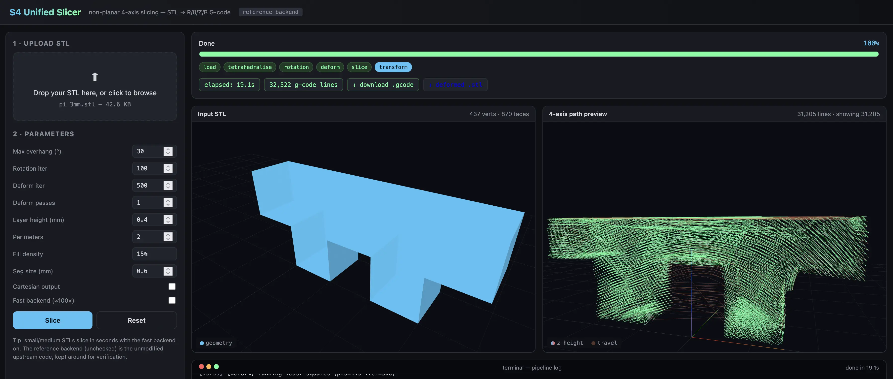

# S4 Unified Slicer

<video src="https://github.com/makebuilddesign/s4-unified-slicer/raw/main/docs/img/s4unified.mp4" 
       controls="controls" 
       muted="muted" 
       loop="loop" 
       autoplay="autoplay" 
       playsinline="playsinline"
       style="max-width: 100%;">
</video>



A **single-step CLI + web UI** that turns an STL into a non-planar 4-axis
(C, X, Z, B) G-code program for a polar 4-axis printer — based on
[Joshua Bird's S4 Slicer](https://github.com/jyjblrd/S4_Slicer)
(GPL-3.0; this work is too).

The unified slicer keeps the upstream algorithms intact but adds:

1. A **web UI** (`s4slicer-web`) with STL upload, live progress,
   and 3-D preview of the final non-planar 4-axis path.
2. A unified `s4_slicer.pipeline.run_pipeline()` shared by CLI and UI.
3. **Live Path Visualization**: Real-time 4-axis path preview with
   multicolor line tracing and a toggle for uniform coloring.

---

## What it does (pipeline — unchanged from upstream)

```
STL  →  tetrahedralise (TetGen)
     →  rotation-field optimisation (least-squares)
     →  vertex deformation (least-squares)
     →  slice deformed mesh (PrusaSlicer / Slic3r / Cura)
     →  inverse-transform G-code through the deformation field
     →  emit polar 4-axis G-code (`G1 C X Z B E F`)
```

---

## Install

```bash
unzip s4_unified_slicer.zip
cd s4_unified_slicer
pip install -r requirements.txt
sudo apt-get install -y prusa-slicer xvfb            # planar slicer + offscreen GL

# run from source tree (no install needed)
./s4slicer       --help
./s4slicer-web   --help

# OR install the package
pip install .
s4slicer       --help
s4slicer-web   --help
```

Tetgen / pyvista / numba install best on Linux + Python 3.10+.

---

## Web UI

```bash
$ s4slicer-web
   S4 Unified Slicer — Web UI
   http://127.0.0.1:8765/
```

Then open the URL in a browser. The UI provides a streamlined 4-axis workflow:

* **Upload STL**: Drag and drop your model or click the upload zone.
* **Configure Parameters**: Key knobs like max overhang, iterations, layer height, etc.
* **Slice**: Click the **Slice** button to stream real-time progress and logs.
* **Inspect**: The 4-axis path preview shows extrusions with multicolor line tracing and travel in orange.
* **Download**: Buttons for the final polar `.gcode` and the deformed `.stl`.

The UI is self-contained: `three.js` and a small custom OrbitControls
ship in `s4_slicer/web/static/`, no internet connection required at
runtime.

---

## CLI

```bash
s4slicer INPUT.stl [-o OUTPUT.gcode] [options]

# Default settings (works for the included `pi 3mm.stl`):
s4slicer "examples/pi 3mm.stl" -o pi.gcode

# Larger/steeper part:
s4slicer my_bracket.stl \
    --max-overhang 35 --rotation-multiplier 2 \
    --rot-iter 200 --deform-iter 1500 \
    --layer-height 0.2 --perimeters 3 --fill-density 20% \
    -o bracket.gcode
```

The CLI prints a **progress bar** to stderr while it runs. Pass
`--no-progress` if your terminal can't render the bar, or `--quiet` to
silence everything but the final output path.

All upstream options still work; see `s4slicer --help`.

---

## Project layout

```
s4_unified_slicer/
├── s4slicer                # CLI launcher (run without installing)
├── s4slicer-web            # web-UI launcher
├── setup.py                # `pip install .`
├── requirements.txt
├── README.md
├── CHANGELOG.md            # project changes
├── LICENSE                 # GPL-3.0 (inherited from upstream)
└── s4_slicer/
    ├── __init__.py
    ├── cli.py              # argparse + orchestration (with progress)
    ├── pipeline.py         # unified runner (CLI + web share this)
    ├── progress.py         # progress reporter / queue
    ├── deform.py           # deform algorithm
    ├── slice_engine.py     # planar slicer wrapper
    ├── gcode_transform.py  # gcode → polar 4-axis (C, X, Z, B)
    ├── web/
    │   ├── __init__.py
    │   ├── app.py          # FastAPI server + SSE
    │   ├── templates/
    │   │   └── index.html  # single-page UI
    │   └── static/
    │       ├── app.js      # browser-side logic + 3D viewports
    │       ├── three.min.js        # bundled
    │       └── orbitcontrols.js    # bundled (compact)
    ├── configs/
    │   └── cura_config.3mf
    └── examples/           # sample STLs from the upstream project
```

---

## Output format

The output is the same polar 4-axis G-code that upstream produced:

```
G94                  ; mm/min feed
G28                  ; home
M83                  ; relative extrusion
G1 E10               ; prime
G94
G90                  ; absolute positioning
G0 C0 X0 Z20 B0      ; go to start
G93                  ; inverse time feed
G01 C12.34 X45.67 Z2.10 B-3.45 E0.0123 F8.42
...
```

Where `C` is rotational stage angle (deg), `X` is radial (mm), `Z` is
build height (mm), `B` is nozzle tilt (deg), `E` is relative extrusion,
`F` is inverse-time feed (1/min).

---

## Credits

* **Upstream project**: [Joshua Bird's S4 Slicer](https://github.com/jyjblrd/S4_Slicer)
  — the algorithms, STL examples, and the entire research idea.
  Cite his BibTeX entry if you use this in academic work.
* This unified package: a re-organised, single-step version of the same
  algorithms, with a web UI.
* Licensed **GPL-3.0**, same as upstream.
